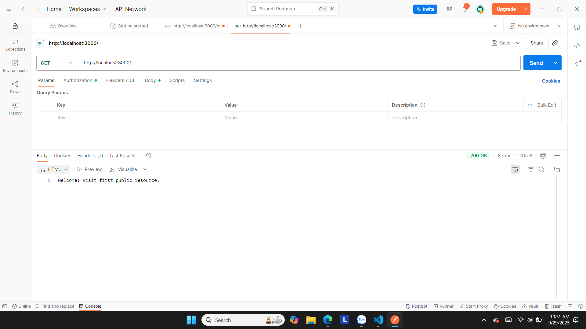
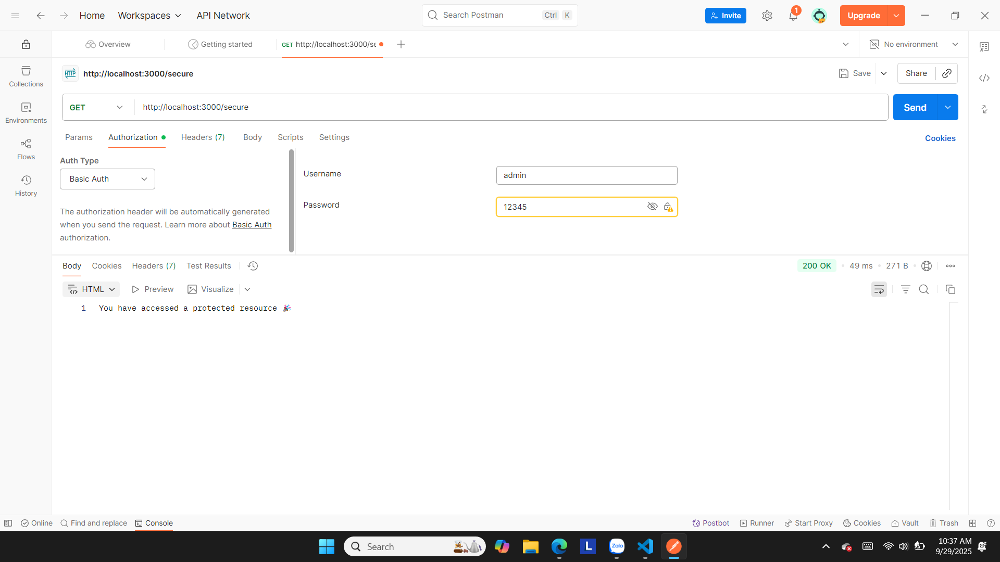
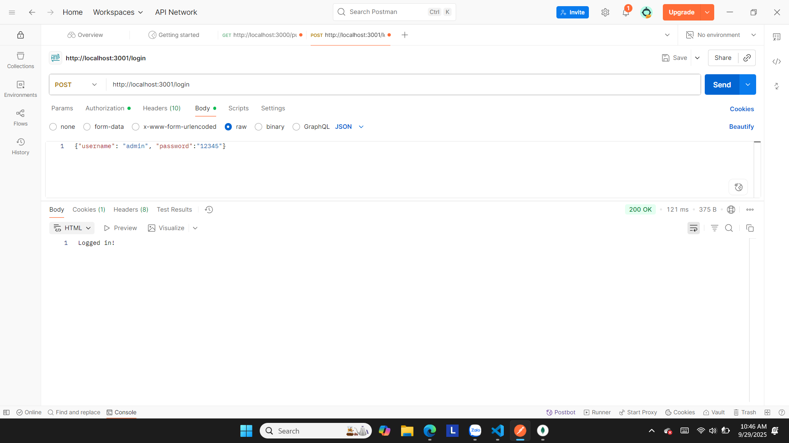
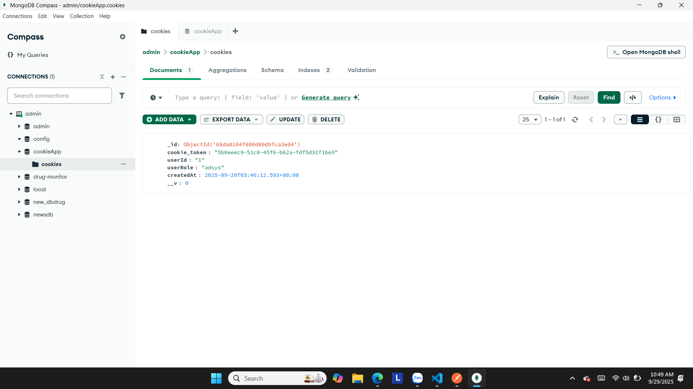
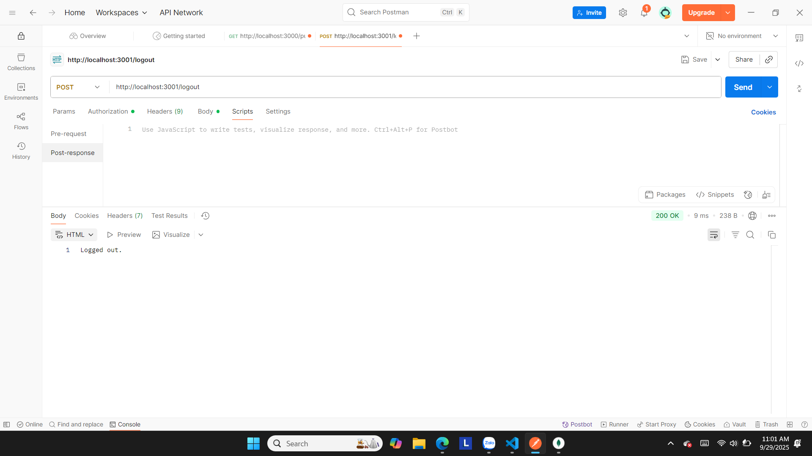

# simple_auth
# Basic_Authenticaton
# Hình 1: Truy cập không có xác thực http://localhost:3000/

# Hình 2: Truy cập với http://localhost:3000/secure có xác thực username và password

# Hình 3: Truy cập với http://localhost:3000/secure không cần xác thực username và password

# Cookie_Authenticaton
# Hình 1: Đăng nhập thành công vào hệ thống http://localhost:3001/login

# Hình 2: Kiểm tra CSDL MongoDB lưu trữ thông tin về cookie của người dùng

# Hình 3: Truy cập với đường dẫn http://localhost:3001/profile để xem thông tin, nếu cookie đã được tạo thành công thì trả về thông tin cookie đã tồn tại

# Hình 4: Truy cập với đường dẫn http://localhost:3001/logout để đăng xuất khỏi tài khoản người dùng

